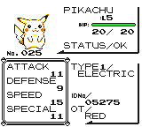

<!-- @import "[TOC]" {cmd="toc" depthFrom=2 depthTo=3 orderedList=false} -->

<!-- code_chunk_output -->

- [Quickstart](#quickstart)
- [Details](#details)
- [Troubleshooting](#troubleshooting)
- [Credits](#credits)

<!-- /code_chunk_output -->

# PKMN

PKMN is an app for Pokémon RBY and GSC. It calculates DVs and shows learnsets, evolutions and the details of known moves and held items. No need to insert data into calculators or search online: PKMN shows you the info for the Pokémon you have selected in the game. It reads directly from the screen and processes everything in the browser; no data leaves your computer! 

## Quickstart

1. Open the summary screen (STATS) of a Pokémon in the game.
1. Click "Select screen" to select the window or screen that shows the game.
1. Click "Scan once" to scan the screen once and "Start scanning" to scan it continuously. 
1. See the results of the scan.

<figure>
  

  
  
  

  <figcaption>
  To access the summary, open the main menu with the START button, go into your party, select a Pokémon and choose STATS. The steps are the same for RBY and GSC.
  </figcaption>
</figure>

<figure>
  

  
  
  
  

  <figcaption>
  The three summary screens in Pokémon GSC show the details of your Pokémon. The app shows different info based on the screen that is scanned.
  </figcaption>
</figure>

<figure>
  

  
  
  

  <figcaption>
  Pokémon RBY shows the details on two screens.
  </figcaption>
</figure>

## Details

The PKMN supports the English version of Pokémon RBY and GSC. It may have partial functionality for other language variants though; the DV calculation works with Pokémon Gelbe Edition too.

The app works with emulators,s and videos -- if the conditions are met. The game screen needs to be in the original 10:9 aspect ratio, to be fully visible (mind the cursor), to have no white borders directly around it and to be neither blurry nor distorted. It is not expected to work with photos taken with a camera. Super Game Boy borders may be enabled.

<figure>
  

  
  
  

  <figcaption>
  Super Game Boy borders with Pokémon Blue and Gold.
  </figcaption>
</figure>

The DV calculation works for recently caught Pokémon. Through battling and consuming certain items, Pokémon gain stat experience that contributes to their total stat values. As this experience is hidden, the calculator assumes it to be 0. Calculating the DV of a Pokémon that collected plenty of this experience will be inaccurate or will result in an error. Read more about stat experience on [stat Bulbapedia](https://bulbapedia.bulbagarden.net/wiki/Effort_values#Stat_experience). 

The DV calculation has other limitations. Finer details, such as the shared DV value for Spc. Att and Spc. Def, the effects of Gen II gender and the connection between the HP DV and other DVs are not yet taken into account. Read more about stats and DVs on [Bulbapedia](https://bulbapedia.bulbagarden.net/wiki/Individual_values#Generation_I_and_II) and [Smogon](https://www.smogon.com/ingame/guides/rby_gsc_stats).

The app was tested with Firefox on Windows and Ubuntu.

## Troubleshooting

When encountering issues, following these steps can generally solve the majority of them:

- Refresh the page.
- Select the screen or window that shows the game screen.
- Make sure the game is in the original 10:9 aspect ratio.
- Make sure there is no white border directly around the game screen.
- Make sure the screen is fully visible. Mind your cursor.
- Make sure the game shows the Pokémon summary (STATS) screen.
- Try resizing the game screen.
- Click "Show snapshot" to see the image that was scanned last.
- Click "Show screen" to show the window or screen that the app receives as input.
- When multiple games are visible, the one with the bigger screen will be scanned.

With the help of the error messages, this process may be simplified.

**expected image with minimal size of 160x144, got 1x1**:  
This error appears if the source window is minimized.

**could not locate Game Boy screen**:  
The Game Boy screen was not found on the shared window or screen. Make sure it is indeed there. The game needs to be fully visible (mind the cursor), in the original 10:9 aspect ratio and have no white borders around. The Super Game Boy borders need to be disabled.

**could not recognize screen layout**:  
This error indicates that the Game Boy screen was found (likely correctly) and the game screen is not recognized. First, make sure that the game shows a Pokémon summary (stats) screen. Having the cursor on the Game Boy screen can also be a cause.

**could not determine XXX DV range: stat value not found in stat variation XXX**:  
This error appears if a stat has an unexpected(ly high) value. The Pokémon likely gained stat experience through battling or consuming certain items. The DV can not be calculated just from the visible stats anymore.

**could not read XXX: could not read character #X: could not recognize character**:  
A specific field could not be read because a character (letter) is not recognized. The game should be fully visible and not even the cursor should cover the texts. Make sure the game is not blurry and try resizing it until the error goes away.

If in doubt, use the "Show snapshot" button to see the image that was scanned last, and use the "Show screen" button to see the window or screen that the app receives as input.

## Credits

This project would not have been possible without [Bulbapedia](https://bulbapedia.bulbagarden.net/), [Smogon](https://www.smogon.com/) and [Serebii.net](https://www.serebii.net/). The website aesthetics were borrowed from the [MDN Blog](https://developer.mozilla.org/en-US/blog/). Pokémon is a trademark of Nintendo.
